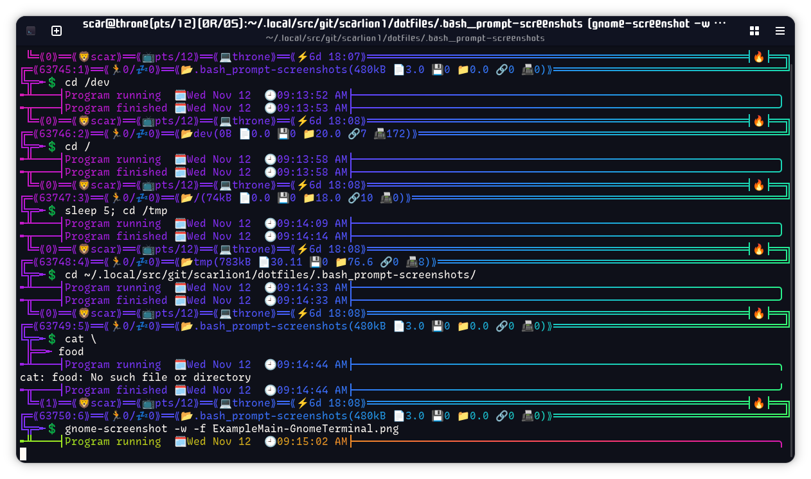

# dotfiles
dotfiles are my personal shell scripts.

Right now all I have to share is my *bash prompt*.

## bash prompt, intro & description
This comment in the default `.bashrc` has always bothered me
> *uncomment for a colored prompt, if the terminal has the capability; turned*
> *off by default to not distract the user: the focus in a terminal window*
> *should be on the output of commands, not on the prompt*

Should it now?  Actually, even the most basic color helps me find where a command started, thus finding the output faster.  Don't think anyone really ogles at a prompt with some green and blue in it, anyway.  Silly hooman, I think you can take that comment and shove it! 😛

My prompt, on the contrary, is worth ogling at.  This is my ridiculous and over-the-top, yet still beautiful, bash prompt.  I started out with Kevin's *rainbow-bash-prompt*[^1] 'and kept "improving" it.  It's fully rainbow in 24-bit color, using jaseg's *lolcat*[^2], each prompt gradually moving across the color spectrum.  It features Unicode characters and emoji, because it's nearly 2023 so why not?  I'm from the 90's though, so had to throwback to some box drawing characters.  I'm actually surprised it hasn't turned into a hot mess; everything displays quite nicely in *Gnome Terminal*.  I added fallback options too for when not in a graphical environment or otherwise don't have Unicode or color support.

The first line shows the exit status/code of the last command, user name, user's tty, short hostname, and the system's uptime.  It also features an eternal flame to make sure things keep running.

The second line shows the length of your command history, the command number for the current session, running jobs, sleeping jobs, current directory, and stats about the directory's contents: size of the data in this directory (not including subdirectories), number of regular and hidden files, number of programs/executables, number of directories and hidden directories, number of links (visible plus hidden), and number of special files (block devices, character devices, pipes, and sockets).

Finally, the third line is where you can actually enter your command!

I added a matching PS2 for those long multi-line commands, as well as a pre-command to update the titlebar/tab of the terminal emulator with what is currently running.

Everything is rounded off with a fourth line (technically PS0) and fifth line (technically PS1 line zero), giving the illusion of the prompt dropping the output of your command, only to gather it back up into the next prompt.  The fourth line features the date and time stamp of when you executed your command, and the fifth line features the date and time stamp of command completion.  In case your command doesn't have any output, the lines will connect nicely together to make sure everything continues.

Did you know there are more than twenty-four different clock emojis?  Yes!  One for each hour 1-12 and one for each half-hour in between, plus some miscellaneous.  Therefore, if the time is, say, between 10 and 10:29, as in the screenshots, then the prompt will show the 10 o'clock emoji next to the time stamp.  Instead, if the time is between 10:30 and 10:59, then the prompt will show the 10:30 o'clock emoji next to the time stamp! and so on…

The most difficult part for me was figuring out how to pad the right ends of the lines so they remained connected under changing conditions, but I got it!  It turned out to be pretty simple once I found the secret bash code to use.  They will adapt to differing lengths of data displayed in the prompt as well as resizes of the terminal.  Oh, and when to use single or double quotes, that can get confusing.  It's quite hacked together! with different snippets and ideas found over the Internet.  Either way, the implementation is quite consistent.

One problem I've seen is when the session command number increases from 9 to 10 (and 99 to 100, etc.), as you can see in the Terminology screenshot.  Another problem occurs if you descend into a directory with a really long name, forcing that line to wrap.  Fortunately, these issues are quickly resolved by entering the next command, or increasing the width of your emulator window (and entering the next command), respectively.

This's my first time sharing something on github, so I'll probably now want to add repository status & info to the prompt somehow…

Anyway, happy to hear about your suggestions and improvements!  Happy hacking 😁

### Screenshots
|  |
| - |
| Main prompt in Gnome Terminal features 24-bit color with colored emojis |

|  |
| - |
| Main prompt in Terminology features 8-bit color with plain emojis |

|  |
| - |
| Fallback prompt in Debian Console features 4-bit color and no emojis 😢 |

### Installation
#### Dependencies
My *bash prompt* uses the following programs:

- Non-standard
    - *lolcat* (jaseg's version[^2], specifically) (linked as `lolcat-c`)
- Standard
    - GNU *cut*, *date*, *echo*, *gawk* (linked as `awk`), *grep*, *ls*, *printf*, *sed*, *tty*, *wc*

You'll also need an emoji font installed, such as [Noto Emoji](https://fonts.google.com/noto/specimen/Noto+Emoji) or [Noto Color Emoji](https://fonts.google.com/noto/specimen/Noto+Color+Emoji)

#### Setup (Debian-based)
```
sudo apt install coreutils gawk grep sed
export myGitRepos=~/.local/src/git
cd ${myGitRepos} && git clone https://github.com/jaseg/lolcat jaseg/lolcat && cd jaseg/lolcat
make && sudo make install && cd
ln -s /usr/local/bin/lolcat ~/.local/bin/lolcat-c
git clone https://github.com/scarlion1/dotfiles ${myGitRepos}/scarlion1/dotfiles
if [[ -f ~/.bash_prompt ]]; then mv ~/.bash_prompt ~/.bash_prompt.bak; fi
ln -s $(realpath ${myGitRepos}/scarlion1/dotfiles/.bash_prompt) ~/.bash_prompt
unset myGitRepos
```
Now `source ~/.bash_prompt` from your `~/.bashrc` if you aren't already

[^1]: [dosentmatter/rainbow-bash-prompt](https://github.com/dosentmatter/rainbow-bash-prompt)
[^2]: [jaseg/lolcat](https://github.com/jaseg/lolcat/)
